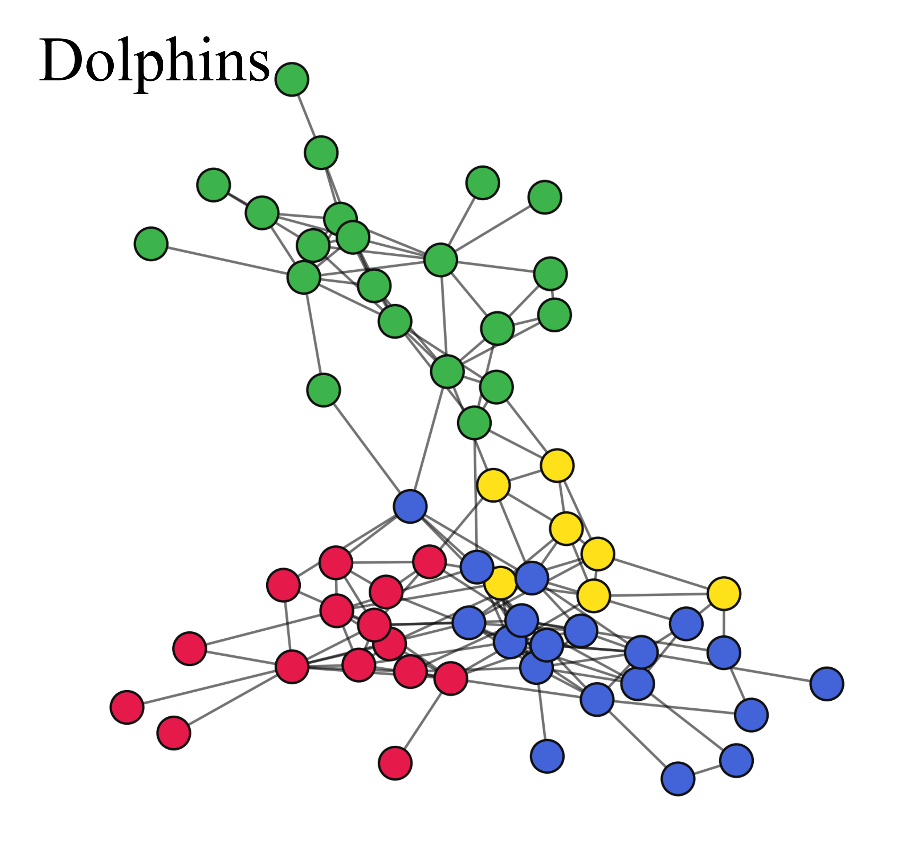
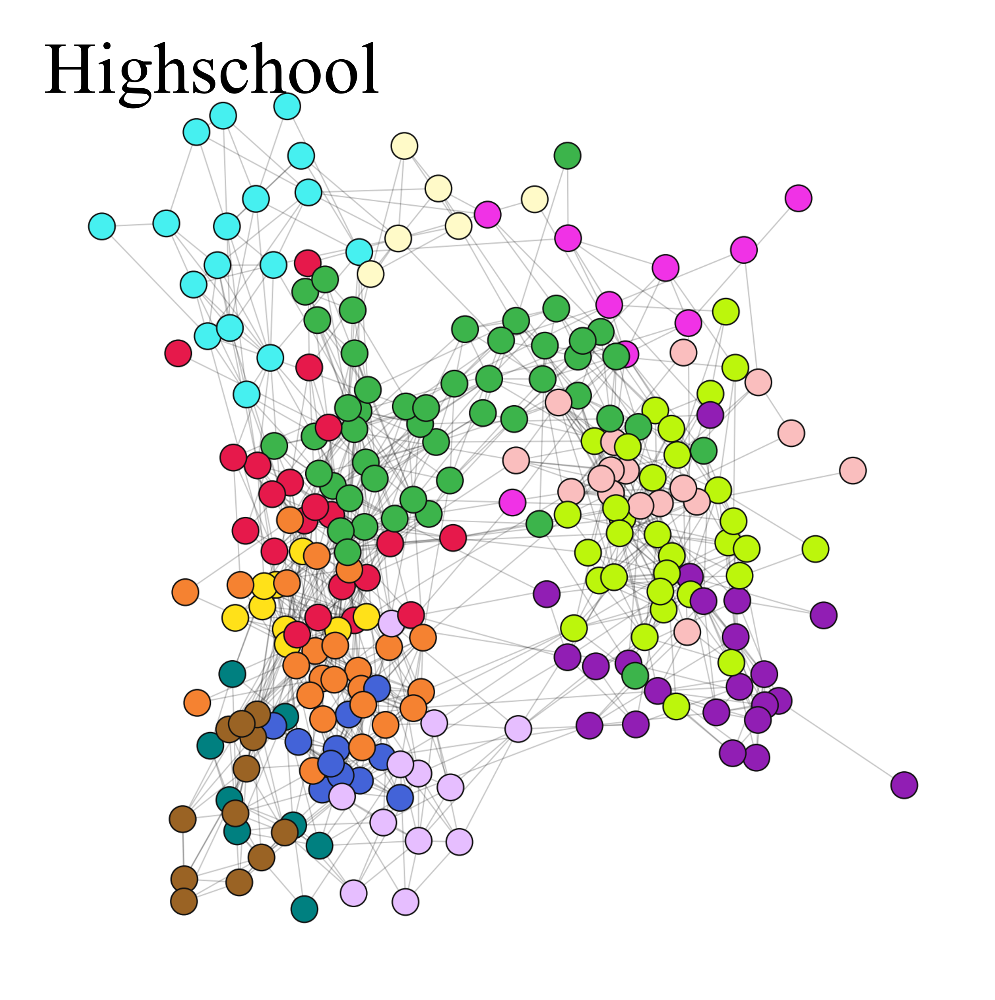

# NINP-LPA

NINP-LPA is an improved label propagation method for community detection that enhances *stability* and *accuracy* by integrating **node importance** and **node–group proximity (NGP)**.

<p align="center">
  
</p>

## Method overview

The algorithm consists of three stages:

1. **Importance-guided initialization (with structure enhancement)**
   - Compute node importance to obtain a fixed (deterministic) update order.
   - Identify key nodes and perform conditional edge removal/addition in their local neighborhoods to construct an enhanced graph \(G^*\).
   - Generate an initial community partition on \(G^*\) and map it back to the original graph.

2. **NGP-guided label propagation**
   - Propagate labels following the fixed importance-based update order.
   - Update labels by maximizing node–group proximity (NGP) to reduce early-noise sensitivity and improve convergence behavior.

3. **Boundary refinement**
   - Refine boundary nodes using neighbor-label frequency.
   - Resolve ties using affiliation degree / influence aggregation to improve robustness on fuzzy boundaries.

## Repository structure

- `main.py`: **entry point** with runnable examples (test / LFR / real-world datasets).
- `ninp_lpa.py`: core implementation of NINP-LPA.
- `Tools/`: graph loading, evaluation.
- `data/` : networks and labels.

## Requirements

Python 3.9+ is recommended.

Install the dependencies:

```bash
pip install -U networkx numpy matplotlib scikit-learn cdlib
```

> Note: Some datasets/visualization utilities may require additional packages depending on your environment.

## How to use

All usage examples are included in **`main.py`**.

### 1) Quick test

In `main.py`, the minimal example is:

```python
from Tools.get_graph import my_Graph
from ninp_lpa import NINP_LPA

file = "./data/network/network_karate.txt"  # path or dataset name handled by Tools/get_graph.py
my_graph = my_Graph()
G = my_graph.createGraph(file)

alg = NINP_LPA(G)
communities = alg.execute()
print(communities)
```

Run:

```bash
python main.py
```

### 2) Real-world datasets with labels

Uncomment the **"real-world with labels"** section in `main.py`, set:

- `file = ./data/network/network_<name>.txt`
- `grouth_file = ./data/community/community_<name>.txt`

Then run:

```bash
python main.py
```

The script reports runtime and evaluation metrics (NMI/ARI/Modularity) if ground-truth labels are provided.

## Baselines

Since multiple baseline methods are used in the experiments, only a minimal example is provided here using a built-in algorithm from NetworkX.  
For other baselines (e.g., **LBLD** and **LMFLS**), please refer to their publicly available Python implementations listed below.

### Public implementations of other baselines

- **LBLD**: https://github.com/hamid-roghani/LBLD-algorithm
- **LMFLS**: https://github.com/hamid-roghani/LMFLS

### Example baseline: NetworkX LPA

```python
# Example baseline: NetworkX asynchronous Label Propagation (LPA)
communities_lpa = list(nx.algorithms.community.asyn_lpa_communities(G))
```

## Output

`execute()` returns:

- `communities`: `List[List[int]]`, the detected communities (each community is a list of node IDs).


## Qualitative results (community visualizations)

The folder **`communities_png/`** contains community detection visualizations on several benchmark networks:

<p align="center">
  
  
</p>
<p align="center">
  
  
</p>
<p align="center">
  
</p>

## Citation

If you use this code in academic work, please cite the corresponding paper.

